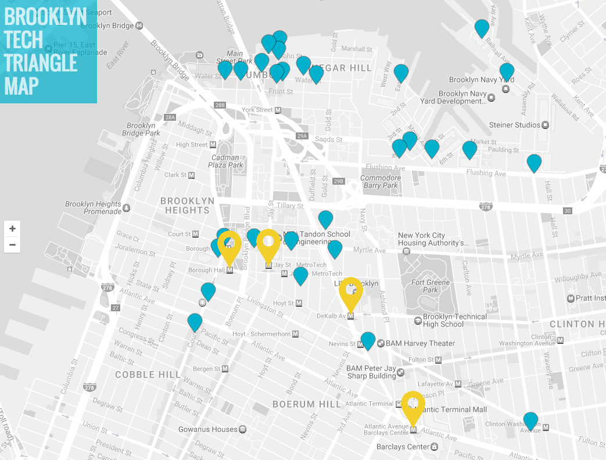

## [WTWY NYC Gala 2017: Creating awareness and support for women in technology](https://github.com/emw1687/metis_projects/blob/master/benson/Presentation.pdf)
### Identifying target MTA stations by traffic, commuter ridership, and income

#### Contributors:
* Galen Ballew [LinkedIn](https://www.linkedin.com/in/galenballew) [GitHub](https://github.com/galenballew)
* Ana Gentle [LinkedIn](https://www.linkedin.com/in/ana-elisa-gentle-96262891/en) [GitHub](https://github.com/anaelisagentle)
* Eva Ward [LinkedIn](https://www.linkedin.com/in/eva-ward) [GitHub](https://github.com/emw1687)

#### Summary
WomenTechWomenYes (WTWY), a non-profit organization in New York City, is raising money for their inaugural girl’s summer coding bootcamp. In order to provide underprivileged girls with scholarships, they need to raise $50,000 at their annual fundraising gala. From their previous galas, WTWY knows women working in tech and attendees with incomes above $200,000 are most likely to donate. To promote the event, street teams are being placed outside subway stations to hand out free gala tickets.

In order to optimize the locations of our street teams, we combined MTA turnstile data with census data to locate subway stops in neighborhoods with high income households and high commuter ridership. We then prioritized stations near major tech companies, recommending four stations in Brooklyn (Jay St/Metrotec, Borough Hall, DeKalb Ave, and Atlantic Ave - Barclays), shown in yellow on the map below.

_Basemap Source: http://map.brooklyntechtriangle.com_

#### Tools
* [Google Maps Geocoding API](https://developers.google.com/maps/documentation/geocoding/start)
* [pandas](http://pandas.pydata.org/)

#### Pipeline
1. [Retrieve zip codes for all MTA station names using the Google Maps Geocoding API](https://github.com/emw1687/metis_projects/blob/master/benson/01_zip_codes.ipynb)
2. [Identify target zip codes, defined as those with high commuter ridership (over 68%) and high average income (at least 2,000 households with household income over $200k)](https://github.com/emw1687/metis_projects/blob/master/benson/02_census_eda.ipynb)
3. [Identify MTA stations with highest weekday (commuter) ridership within target zip codes](https://github.com/emw1687/metis_projects/blob/master/benson/03_mta_turnstiles_eda.ipynb)
